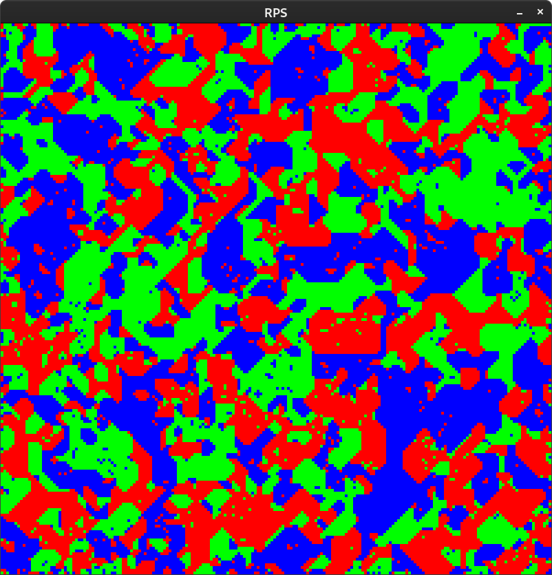
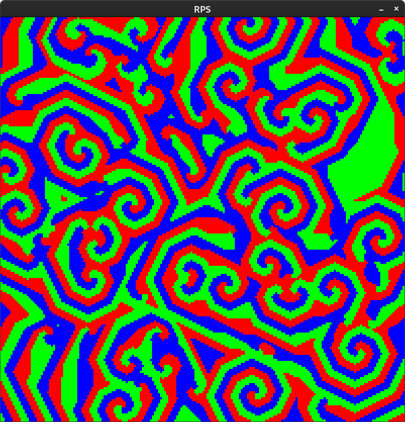
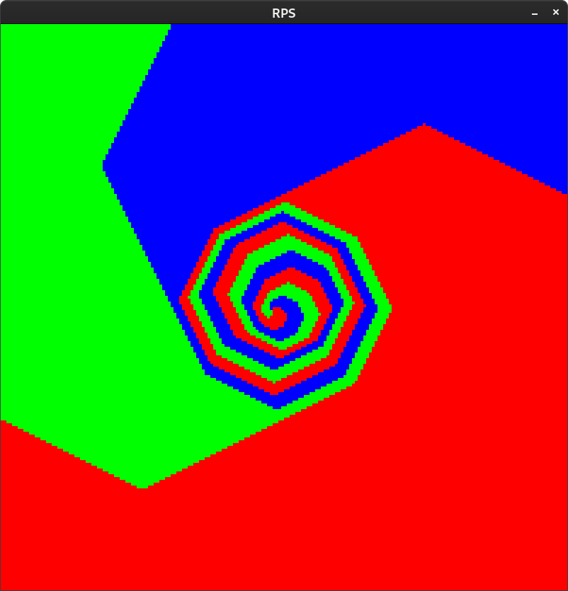
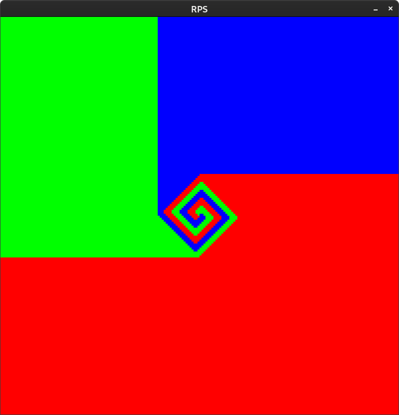
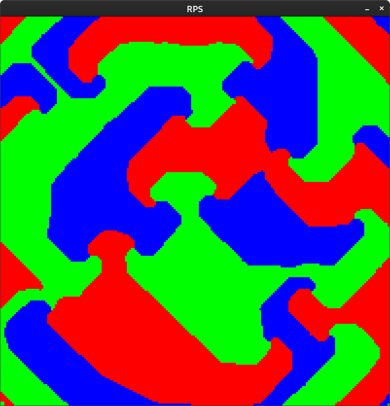

not working idk why lol

There's this parameter, neighbour threshold

## Terrain N = 4

steady states to this, I like how its mostly 90/45 degrees like a public transport map. Kinda looks like terrain, it has some constraints to it obviously, could be interesting for gameplay. Could impose more structure via

### obviously
green = ground
blue = ocean
red = ...mountain

### edge detection
green meeting blue = beach (yellow)
blue meeting red = cliffs

### flood filling
red entire enclosed in blue = island (cyan)
green entirely enclosed in red = plateau (white)

recursive edge detection / rare biomes: 
yellow meets red: idk dunes or beach cliffs

## Random Spirals N = 3

from a randomized start configuration

## Single Nucleation Point N = 3

45 degree rotated octagon

## Single Nucleation Point N = 2

45 degree rotated square

## OK this is cool N = 3.99

so some configurations get advanced out of very fast and others very slow

so it kind of approaches an N=4 steady state but that itself gradually evolves

pretty cool concept, could definitely imagine things like that happening in physics

## Cosmic rays

I think maybe anything you do where its nearly N=4 but you tip the scales a bit is interesting
old areas get compromised
you could restrict mutation to boundaries if they overpowered their predator with high enough numbers
over time it just gets mixed into one thing I predict, that keeps changing. Or would it? with high radiation rate it does make spirals and they are pretty cool and messy.

why do the spirals always emerge, are they a PDE solution? Or satisfying some constraint

# Todos
randomize threshold

## Future????
3d would have a much greater range of sensible N parameters, plus the caves would look mad
add edge detect biomes then do more rounds 
subdivide and do more rounds
do more rounds only in one colour

omg could you have cool CA terrain gen that did height and then have it punch a river downhill once it reaches a certain state
like one state per z level and if its water or not

i guess this is a lot like distance buffer thing
could also do cellular sediment deposition to meander

tweak starting distribution
paint starting distribution

parameterize and tweak number of states

could have asymmetrical application of rules

different distribution of tiles, like maybe a rare tile but once it appears it stays

have a moderator that gets beaten by anything but more of it, well how would it come about, it would have to beat something itself
could have states decay into one another
maybe once stable turn into moderator that dies to anything but needs to be more of it

what about N=4 but have an anti-red cosmic ray that has a chance to spawn that reks a red by flood fill

what about N=4 but cosmic rays of other element, if it hits a boundary boom

i guess its an example of criticality / phase change